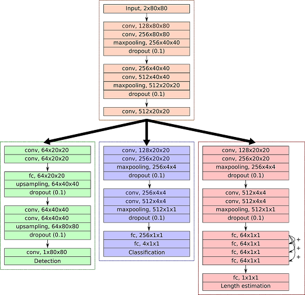

# sar_ship_detect

Ship detection on radar images using Keras

### Experimental dataset

`https://www.kaggle.com/c/statoil-iceberg-classifier-challenge/data` 

## CNN model from the article

## [Ship Identification and Characterization in Sentinel-1 SAR Images with Multi-Task Deep Learning](https://doi.org/10.3390/rs11242997)

### Abstract

The monitoring and surveillance of maritime activities are critical issues in both military and civilian 
fields, including among others fisheries’ monitoring, maritime traffic surveillance, coastal and at-sea 
safety operations, and tactical situations. In operational contexts, ship detection and identification 
is traditionally performed by a human observer who identifies all kinds of ships from a visual analysis 
of remotely sensed images. Such a task is very time consuming and cannot be conducted at a very large scale, 
while Sentinel-1 SAR data now provide a regular and worldwide coverage. Meanwhile, with the emergence of GPUs, 
deep learning methods are now established as state-of-the-art solutions for computer vision, replacing human 
intervention in many contexts. They have been shown to be adapted for ship detection, most often with very 
high resolution SAR or optical imagery. In this paper, we go one step further and investigate a deep neural 
network for the joint classification and characterization of ships from SAR Sentinel-1 data. We benefit from 
the synergies between AIS (Automatic Identification System) and Sentinel-1 data to build significant training 
datasets. We design a multi-task neural network architecture composed of one joint convolutional network 
connected to three task specific networks, namely for ship detection, classification, and length estimation. 
The experimental assessment shows that our network provides promising results, with accurate classification 
and length performance (classification overall accuracy: 97.25%, mean length error: 4.65 m ± 8.55 m).

